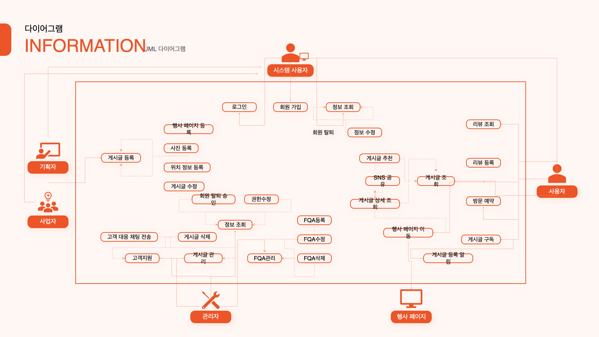
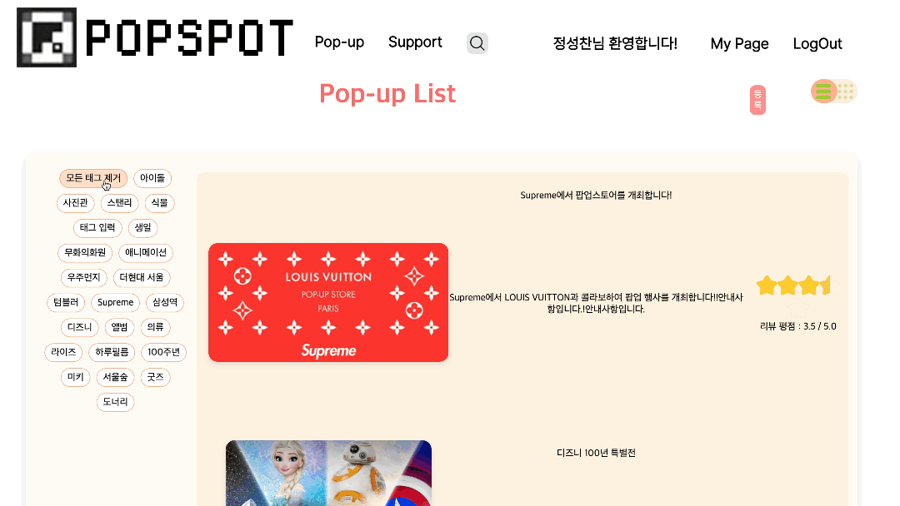
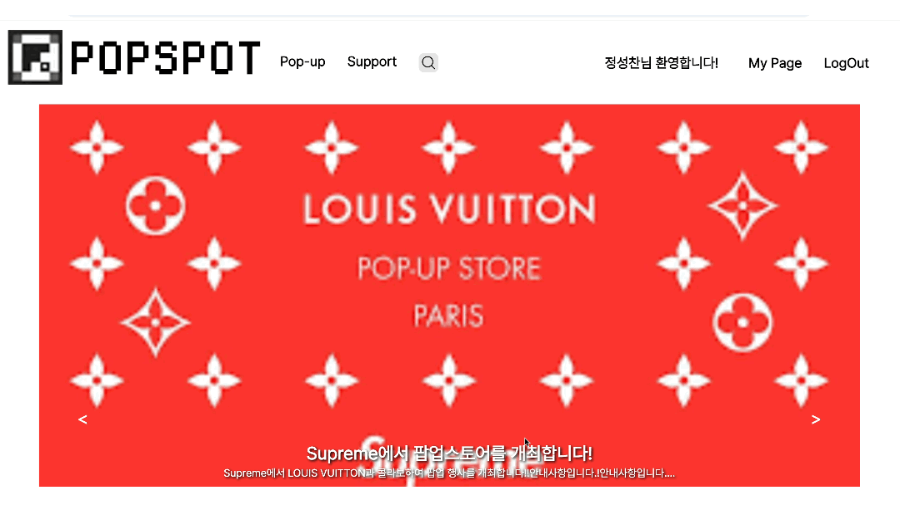

# 🚀 PopSpot (Pop-up Store Introduction & Review Service)

  

---

## 📌 목차

- [📃 프로젝트 소개](#-프로젝트-소개)
- [🗓 제작 기간](#-제작-기간)
- [🧑‍🤝‍🧑 참여 인원](#-참여-인원)
- [🚀 사용 기술-tech-stack](#-사용-기술-tech-stack)
- [🧩 프로젝트 설계](#-프로젝트-설계)
- [🖥 기능 시연](#-기능-시연)
- [💡 프로젝트의 강점](#-프로젝트의-강점)
- [🛠 개선 제안사항](#-개선-제안사항)

---

## 📃 프로젝트 소개
**많은 팝업 스토어를 한눈에 확인할 수 있는 통합 소개 및 리뷰 플랫폼**

---

## 🗓 제작 기간
**2024.08.24 ~ 2024.09.30**

---

## 🧑‍🤝‍🧑 참여 인원
**4명 팀 프로젝트**

- 👑 팀장: 김현수  
- 🤝 부팀장: 김효빈  
- 👩‍💻 팀원: 최서진, 김솔

---

## 🚀 사용 기술 (Tech Stack)

  
  
  
  
  
  
  
  
  
  

---

## 🧩 프로젝트 설계

<strong>📌 ERD 보기</strong>

---

## 🖥 기능 시연

### 🔐 로그인 기능

  

- 로그인 시 sessionStorage에 사용자 정보 저장
- 권한에 따라 다른 메뉴 노출 (user, admin, planner)
- 로그아웃 시 sessionStorage 초기화

---

### 📝 회원가입 & 탈퇴 기능

  
    
  

- 유효성 검사 및 중복 체크
- 사용자 타입 선택 및 회원 정보 등록
- 탈퇴 시 확인창 및 서버 전송

---

### 📺 메인 페이지

  

- 배너 자동 변경 및 수동 조작 가능
- 태그 기반 필터링 및 관련 페이지 이동

---

### 📱 리스트 페이지

  

- 리스트 & 카드 뷰 전환 기능
- 이벤트 클릭 시 상세 페이지 이동

---

### 🔍 상세페이지 & 리뷰

  

- 이벤트 상세 조회, 수정/삭제 기능
- 리뷰 작성/조회/수정/삭제 및 평점 등록 기능

---

### 💬 Q&A & FAQ

  

- 1:1 문의 등록/답변/비공개 설정
- 자주 묻는 질문 FAQ 관리 기능

---

## 💡 프로젝트의 강점

### 1. **접근성**
- 직관적인 UI로 빠르게 팝업스토어 탐색 가능
- 위치, 시간, 리뷰 등 정보 통합 제공

### 2. **확장성**
- 권한별 기능 분리로 보안성 강화
- 유지보수 및 확장성 높은 구조 설계

### 3. **최적화**
- 컴포넌트 분리 & 렌더링 최소화
- 필요한 데이터만 가져오는 API 설계

---

## 🛠 개선 제안사항

  
🔍 검색 기능 강화

  <ul>
    <li>태그 필터 외에 키워드 검색 추가</li>
    <li>팝업스토어명, 위치, 카테고리 기반 검색 구현</li>
  </ul>

  
🧾 리뷰 신뢰도 향상

  <ul>
    <li>방문 인증 기반 리뷰 작성 기능 고려</li>
    <li>좋아요/싫어요 기능 도입으로 유용한 리뷰 상단 노출</li>
  </ul>

  
🗂 이벤트 & 리뷰 관리

  <ul>
    <li>관리자 전용 리뷰/이벤트 관리 기능 추가</li>
    <li>댓글 기능 도입으로 상호작용 유도</li>
  </ul>

  
👤 마이페이지 기능 확장

  <ul>
    <li>찜한 팝업스토어, 작성 리뷰, 문의 내역 확인 기능 추가</li>
  </ul>

  
📬 푸시 알림 & 메일링

  <ul>
    <li>새 이벤트/리뷰/답변 알림 제공</li>
    <li>맞춤형 추천 시스템 도입 가능</li>
  </ul>

---

  <h3>🎉 읽어주셔서 감사합니다. PopSpot 입니다!</h3>

